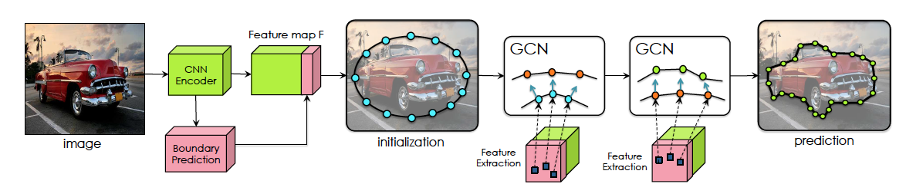

# Curve-GCN

This is the official PyTorch reimplementation of Curve-GCN (CVPR 2019). This repository allows you to train new Curve-GCN models. For technical details, please refer to:  
----------------------- ------------------------------------
**Fast Interactive Object Annotation with Curve-GCN**  
[Huan Ling](http:///www.cs.toronto.edu/~linghuan/)\* <sup>1,2</sup>, [Jun Gao](http://www.cs.toronto.edu/~jungao/)\* <sup>1,2</sup>, [Amlan Kar](http://www.cs.toronto.edu/~amlan/)<sup>1,2</sup>, [Wenzheng Chen](http://www.cs.toronto.edu/~wenzheng/)<sup>1,2</sup>, [Sanja Fidler](http://www.cs.toronto.edu/~fidler/)<sup>1,2,3</sup>   
<sup>1</sup> University of Toronto  <sup>2</sup> Vector Institute <sup>3</sup> NVIDIA  
**[[Paper]()] [[Video]()][[Demo]()]**   

**CVPR 2019**



*Manually labeling objects by tracing their boundaries is
a laborious process. In Polyrnn, the authors proposed Polygon-
RNN that produces polygonal annotations in a recurrent
manner using a CNN-RNN architecture, allowing interactive
correction via humans-in-the-loop. We propose a new framework
that alleviates the sequential nature of Polygon-RNN,
by predicting all vertices simultaneously using a Graph Convolutional
Network (GCN). Our model is trained end-to-end,
and runs in real time. It supports object annotation by either
polygons or splines, facilitating labeling efficiency for both
line-based and curved objects. We show that Curve-GCN outperforms
all existing approaches in automatic mode, including
the powerful PSP-DeepLab and is significantly
more efficient in interactive mode than Polygon-RNN++.
Our model runs at 29.3ms in automatic, and 2.6ms in interactive
mode, making it 10x and 100x faster than Polygon-
RNN++.*  
(\* denotes equal contribution)    
----------------------- ------------------------------------


# Where is the code?
To get the code, please [signup](http://www.cs.toronto.edu/curvegcn/code_signup/) here. We will be using GitHub to keep track of issues with the code and to update on availability of newer versions (also available on website and through e-mail to signed up users).

If you use this code, please cite:

    @inproceedings{CurveGCN2019,
    title={Fast Interactive Object Annotation with Curve-GCN},
    author={Huan Ling and Jun Gao and Amlan Kar and Wenzheng Chen and Sanja Fidler},
    booktitle={CVPR},
    year={2019}
    }


# License

This work is licensed under a *GNU GENERAL PUBLIC LICENSE Version 3* License.


# Environment Setup
All the code has been run and tested on Ubuntu 16.04, Python 2.7.12, Pytorch 0.4.1, CUDA 9.0, TITAN X/Xp and GTX 1080Ti GPUs

- Go into the downloaded code directory
```
cd <path_to_downloaded_directory>
```
- Setup python environment
```
virtualenv env
source env/bin/activate
pip install -r requirements.txt
```
- Add the project to PYTHONPATH  
```
export PYTHONPATH=$PWD
```

## Data 

### Cityscapes
- Download the Cityscapes dataset (leftImg8bit\_trainvaltest.zip) from the official [website](https://www.cityscapes-dataset.com/downloads/) [11 GB]
- Our processed annotation files are included in the download file you get after signing up
- From the root directory, run the following command with appropriate paths to get the annotation files ready for your machine
```
python Scripts/data/change_paths.py --city_dir <path_to_downloaded_leftImg8bit_folder> --json_dir <path_to_downloaded_annotation_file> --out_dir <output_dir>
```

## Training

- Download the pre-trained Pytorch Resnet-50 from [here](https://download.pytorch.org/models/resnet50-19c8e357.pth)

### Train Spline GCN

- Modify "exp\_dir", "encoder\_reload", "data\_dir" attributes at Experiments/gnn-active-spline.json
- Run script:
```
python Scripts/train/train_gnn_active_spline.py --exp Experiments/gnn-active-spline.json
```

Checkpoint to reproduce numby in paper is available at [website](https://drive.google.com/open?id=1kzXSgsbbOTLOoYG3MOtwiD4thPnrH0b5)


### Finetune Spline GCN by Diffrender
- Modify "exp\_dir", "encoder\_reload", "data\_dir" attributes at Experiments/gnn-active-spline.json
- Modify "xe\_initializer" to be the best checkpoint from the last step. Or download from [website](https://drive.google.com/open?id=1kzXSgsbbOTLOoYG3MOtwiD4thPnrH0b5).
- Run script:
```
python Scripts/train/train_gnn_active_spline_diffrender.py --exp Experiments/gnn-active-spline-diff-render.json
```

Checkpoint to reproduce numby in paper is available at [website](https://drive.google.com/open?id=19mA3tyS9UjjR0nlsyPNFTP2Ln3ZGarcK)


## Prediction
Generate prediction masks:  
```
python Scripts/train/train_gnn_active_spline_diffrender.py --exp <path to exp file> --output_dir <path to output dir> --reload <path to checkpoint> 
```

Calculate IOU:  
```
python Scripts/get_scores.py --pred <path to output dir> --output  <path to output txt file>
```
